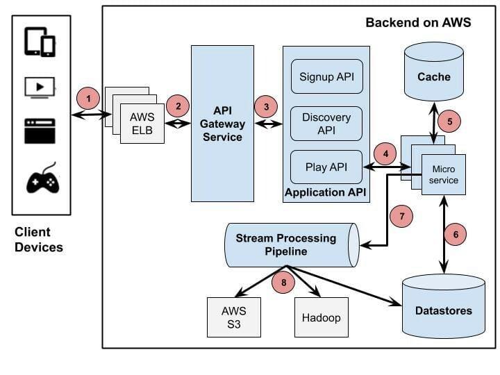

# Use visual resources

If you can, replace a paragraph with a visual resource, as images, charts, gifs, or videos. The user will understand more a visual architecture than a text explanation.

>The goal of graphics is to help to convey information. The graphic should be focused on the user and be clear on pass the message.

After the resource, you may give an additional description of what it means.