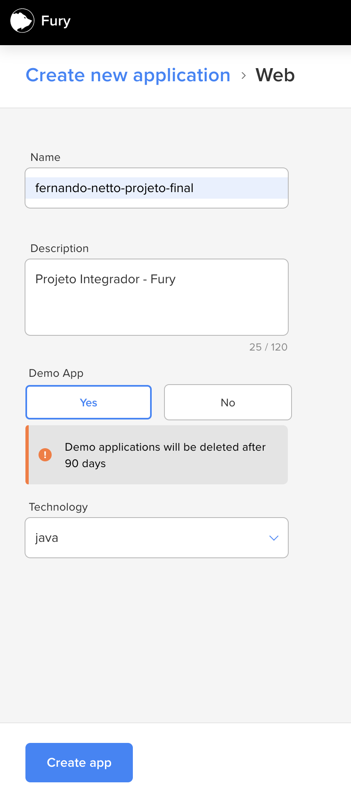
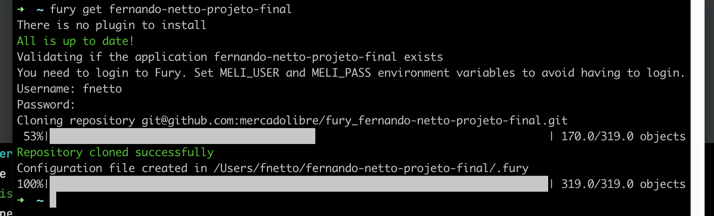
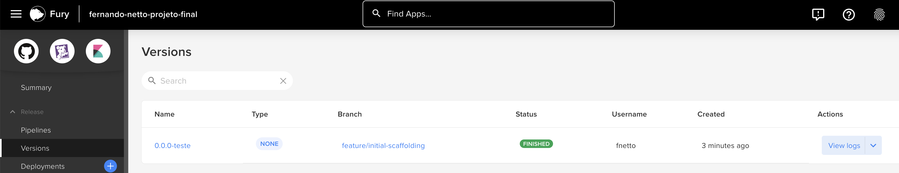
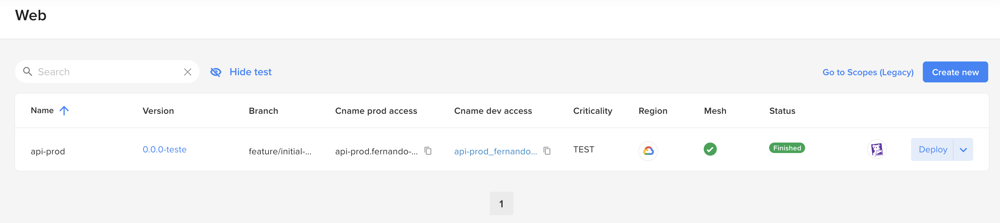
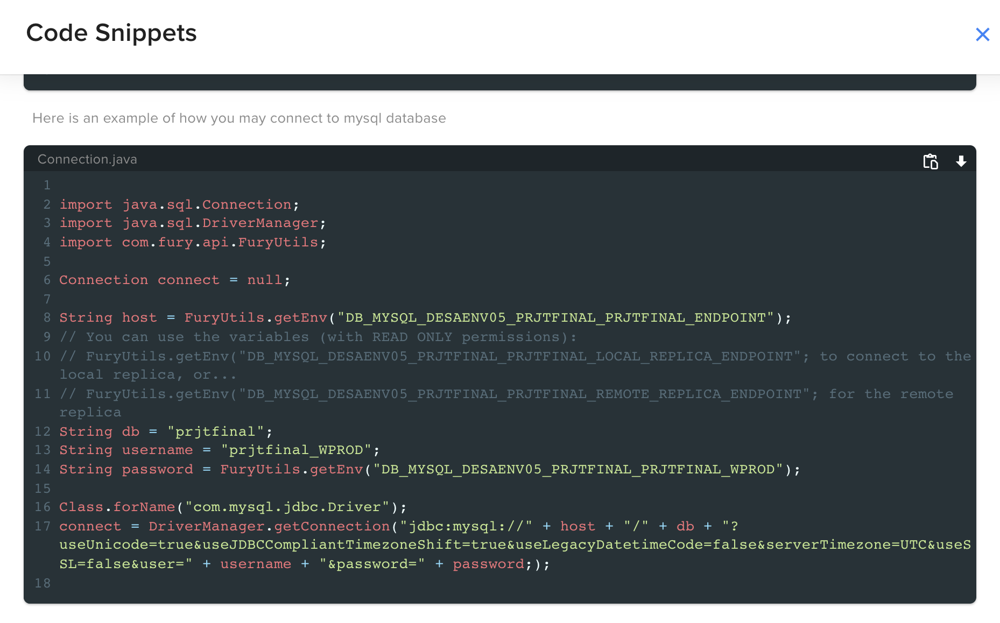

# Evidences 
### Fury Deploy
 

Fury 01 - Create Project

 

Fury 02 - Fury Get

 

Fury 03 - Create Version

 

Fury 04 - Jenkins

 

Fury 05 - Version OK

 

Fury 06 - Deploy

 

Fury 07 - Web Scope OK

 

Fury 08 - Ping-Pong

 

Fury 09 - Snippets for DB

 

Fury 10 - DB Created

 

Fury 11 - Git Repository MeLi

