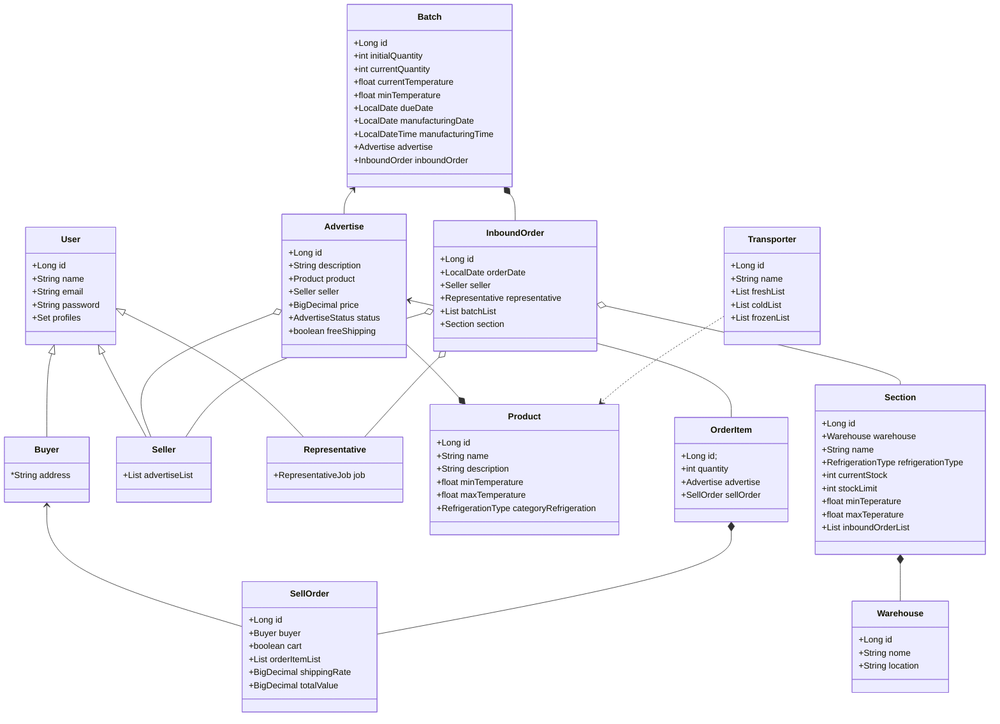

# Modelagem de Classe e ER
## Versão Final
#### Diagrama de Classes UML

```plantuml
@startuml

title __ENTITY's Class Diagram__\n

  namespace com.mercadolibre.w4g9projetofinal {
    namespace entity {
      class com.mercadolibre.w4g9projetofinal.entity.Advertise {
          - description : String
          - freeShipping : boolean
          - id : Long
          - price : BigDecimal
          + Advertise()
          + Advertise()
          + equals()
          + getDescription()
          + getId()
          + getPrice()
          + getProduct()
          + getSeller()
          + getStatus()
          + hashCode()
          + isFreeShipping()
          + setDescription()
          + setFreeShipping()
          + setId()
          + setPrice()
          + setProduct()
          + setSeller()
          + setStatus()
          + toString()
      }
    }
  }
  

  namespace com.mercadolibre.w4g9projetofinal {
    namespace entity {
      class com.mercadolibre.w4g9projetofinal.entity.Batch {
          - currentQuantity : int
          - currentTemperature : float
          - dueDate : LocalDate
          - id : Long
          - initialQuantity : int
          - manufacturingDate : LocalDate
          - manufacturingTime : LocalDateTime
          - minTemperature : float
          + Batch()
          + Batch()
          + equals()
          + getAdvertise()
          + getCurrentQuantity()
          + getCurrentTemperature()
          + getDueDate()
          + getId()
          + getInboundOrder()
          + getInitialQuantity()
          + getManufacturingDate()
          + getManufacturingTime()
          + getMinTemperature()
          + hashCode()
          + setAdvertise()
          + setCurrentQuantity()
          + setCurrentTemperature()
          + setDueDate()
          + setId()
          + setInboundOrder()
          + setInitialQuantity()
          + setManufacturingDate()
          + setManufacturingTime()
          + setMinTemperature()
          + toString()
          + updateStock()
          + verifyStock()
      }
    }
  }
  

  namespace com.mercadolibre.w4g9projetofinal {
    namespace entity {
      class com.mercadolibre.w4g9projetofinal.entity.Buyer {
          - address : String
          + Buyer()
          + Buyer()
          + equals()
          + getAddress()
          + hashCode()
          + setAddress()
          + toString()
      }
    }
  }
  

  namespace com.mercadolibre.w4g9projetofinal {
    namespace entity {
      class com.mercadolibre.w4g9projetofinal.entity.InboundOrder {
          - batchList : List<Batch>
          - id : Long
          - orderDate : LocalDate
          + InboundOrder()
          + InboundOrder()
          + equals()
          + getBatchList()
          + getId()
          + getOrderDate()
          + getRepresentative()
          + getSection()
          + getSeller()
          + hashCode()
          + setBatchList()
          + setId()
          + setInboundOrderToBatchList()
          + setOrderDate()
          + setRepresentative()
          + setSection()
          + setSeller()
          + toString()
      }
    }
  }
  

  namespace com.mercadolibre.w4g9projetofinal {
    namespace entity {
      class com.mercadolibre.w4g9projetofinal.entity.OrderItem {
          - id : Long
          - quantity : int
          + OrderItem()
          + OrderItem()
          + calculaValorTotalProduto()
          + getAdvertise()
          + getId()
          + getQuantity()
          + getSellOrder()
          + setAdvertise()
          + setId()
          + setQuantity()
          + setSellOrder()
          + toString()
      }
    }
  }
  

  namespace com.mercadolibre.w4g9projetofinal {
    namespace entity {
      class com.mercadolibre.w4g9projetofinal.entity.Product {
          - description : String
          - id : Long
          - maxTemperature : float
          - minTemperature : float
          - name : String
          + Product()
          + Product()
          + equals()
          + getCategoryRefrigeration()
          + getDescription()
          + getId()
          + getMaxTemperature()
          + getMinTemperature()
          + getName()
          + hashCode()
          + setCategoryRefrigeration()
          + setDescription()
          + setId()
          + setMaxTemperature()
          + setMinTemperature()
          + setName()
          + toString()
      }
    }
  }
  

  namespace com.mercadolibre.w4g9projetofinal {
    namespace entity {
      class com.mercadolibre.w4g9projetofinal.entity.Representative {
          + Representative()
          + Representative()
          + Representative()
          + equals()
          + getJob()
          + hashCode()
          + setJob()
          + toString()
      }
    }
  }
  

  namespace com.mercadolibre.w4g9projetofinal {
    namespace entity {
      class com.mercadolibre.w4g9projetofinal.entity.Section {
          - currentStock : int
          - id : Long
          - inboundOrderList : List<InboundOrder>
          - maxTeperature : float
          - minTeperature : float
          - name : String
          - stockLimit : int
          + Section()
          + Section()
          + equals()
          + getCurrentStock()
          + getId()
          + getInboundOrderList()
          + getMaxTeperature()
          + getMinTeperature()
          + getName()
          + getRefrigerationType()
          + getStockLimit()
          + getWarehouse()
          + hashCode()
          + setCurrentStock()
          + setId()
          + setInboundOrderList()
          + setMaxTeperature()
          + setMinTeperature()
          + setName()
          + setRefrigerationType()
          + setStockLimit()
          + setWarehouse()
          + toString()
          + updateStock()
      }
    }
  }
  

  namespace com.mercadolibre.w4g9projetofinal {
    namespace entity {
      class com.mercadolibre.w4g9projetofinal.entity.SellOrder {
          - cart : boolean
          - id : Long
          - orderItemList : List<OrderItem>
          - shippingRate : BigDecimal
          - totalValue : BigDecimal
          + SellOrder()
          + SellOrder()
          + calcTotalValueOrder()
          + equals()
          + getBuyer()
          + getId()
          + getOrderItem()
          + getOrderItemList()
          + getShippingRate()
          + getTotalValue()
          + hashCode()
          + isCart()
          + setBuyer()
          + setCart()
          + setId()
          + setOrderItemList()
          + setShippingRate()
          + setTotalValue()
          + toString()
          + updateCart()
          - calculateShipping()
          - mockShippingRateByAddress()
      }
    }
  }
  

  namespace com.mercadolibre.w4g9projetofinal {
    namespace entity {
      class com.mercadolibre.w4g9projetofinal.entity.Seller {
          - advertiseList : List<Advertise>
          + Seller()
          + Seller()
          + equals()
          + getAdvertiseList()
          + hashCode()
          + setAdvertiseList()
          + toString()
      }
    }
  }
  

  namespace com.mercadolibre.w4g9projetofinal {
    namespace entity {
      class com.mercadolibre.w4g9projetofinal.entity.Transporter {
          - coldList : List<Product>
          - freshList : List<Product>
          - frozenList : List<Product>
          - id : Long
          - name : String
          + Transporter()
          + Transporter()
          + equals()
          + getColdList()
          + getFreshList()
          + getFrozenList()
          + getId()
          + getName()
          + hashCode()
          + setColdList()
          + setFreshList()
          + setFrozenList()
          + setId()
          + setName()
          + toString()
      }
    }
  }
  

  namespace com.mercadolibre.w4g9projetofinal {
    namespace entity {
      abstract class com.mercadolibre.w4g9projetofinal.entity.User {
          - email : String
          - id : Long
          - name : String
          - password : String
          - profiles : Set<Profile>
          - username : String
          + User()
          + User()
          + addProfile()
          + equals()
          + getEmail()
          + getId()
          + getName()
          + getPassword()
          + getProfile()
          + getProfiles()
          + getUsername()
          + hashCode()
          + setEmail()
          + setId()
          + setName()
          + setPassword()
          + setProfiles()
          + setUsername()
          + toString()
      }
    }
  }
  

  namespace com.mercadolibre.w4g9projetofinal {
    namespace entity {
      class com.mercadolibre.w4g9projetofinal.entity.Warehouse {
          - id : Long
          - location : String
          - nome : String
          + Warehouse()
          + Warehouse()
          + equals()
          + getId()
          + getLocation()
          + getNome()
          + hashCode()
          + setId()
          + setLocation()
          + setNome()
          + toString()
      }
    }
  }
  

  com.mercadolibre.w4g9projetofinal.entity.Advertise o-- com.mercadolibre.w4g9projetofinal.entity.Product : product
  com.mercadolibre.w4g9projetofinal.entity.Advertise o-- com.mercadolibre.w4g9projetofinal.entity.Seller : seller
  com.mercadolibre.w4g9projetofinal.entity.Advertise o-- com.mercadolibre.w4g9projetofinal.entity.enums.AdvertiseStatus : status
  com.mercadolibre.w4g9projetofinal.entity.Batch o-- com.mercadolibre.w4g9projetofinal.entity.Advertise : advertise
  com.mercadolibre.w4g9projetofinal.entity.Batch o-- com.mercadolibre.w4g9projetofinal.entity.InboundOrder : inboundOrder
  com.mercadolibre.w4g9projetofinal.entity.Buyer -up-|> com.mercadolibre.w4g9projetofinal.entity.User
  com.mercadolibre.w4g9projetofinal.entity.InboundOrder o-- com.mercadolibre.w4g9projetofinal.entity.Representative : representative
  com.mercadolibre.w4g9projetofinal.entity.InboundOrder o-- com.mercadolibre.w4g9projetofinal.entity.Section : section
  com.mercadolibre.w4g9projetofinal.entity.InboundOrder o-- com.mercadolibre.w4g9projetofinal.entity.Seller : seller
  com.mercadolibre.w4g9projetofinal.entity.OrderItem o-- com.mercadolibre.w4g9projetofinal.entity.Advertise : advertise
  com.mercadolibre.w4g9projetofinal.entity.OrderItem o-- com.mercadolibre.w4g9projetofinal.entity.SellOrder : sellOrder
  com.mercadolibre.w4g9projetofinal.entity.Product o-- com.mercadolibre.w4g9projetofinal.entity.enums.RefrigerationType : categoryRefrigeration
  com.mercadolibre.w4g9projetofinal.entity.Representative -up-|> com.mercadolibre.w4g9projetofinal.entity.User
  com.mercadolibre.w4g9projetofinal.entity.Representative o-- com.mercadolibre.w4g9projetofinal.entity.enums.RepresentativeJob : job
  com.mercadolibre.w4g9projetofinal.entity.Section o-- com.mercadolibre.w4g9projetofinal.entity.enums.RefrigerationType : refrigerationType
  com.mercadolibre.w4g9projetofinal.entity.Section o-- com.mercadolibre.w4g9projetofinal.entity.Warehouse : warehouse
  com.mercadolibre.w4g9projetofinal.entity.SellOrder o-- com.mercadolibre.w4g9projetofinal.entity.Buyer : buyer
  com.mercadolibre.w4g9projetofinal.entity.Seller -up-|> com.mercadolibre.w4g9projetofinal.entity.User


right footer


PlantUML diagram generated by SketchIt! (https://bitbucket.org/pmesmeur/sketch.it)
For more information about this tool, please contact philippe.mesmeur@gmail.com
endfooter

@enduml
```

```mermaid
classDiagram
User <|-- Buyer
User <|-- Seller
User <|-- Representative
Advertise o-- Seller
Advertise --* Product
Advertise <-- OrderItem
Batch <-- Advertise
Batch *-- InboundOrder 
Buyer <-- SellOrder
InboundOrder o-- Seller
InboundOrder o-- Representative
InboundOrder o-- Section
OrderItem *-- SellOrder
Section *-- Warehouse
Transporter ..> Product
class Advertise {
        +Long id
        +String description
        +Product product
        +Seller seller
        +BigDecimal price
        +AdvertiseStatus status
        +boolean freeShipping
}
class Batch {
    +Long id
+int initialQuantity
+int currentQuantity
+float currentTemperature
+float minTemperature
+LocalDate dueDate
+LocalDate manufacturingDate
+LocalDateTime manufacturingTime
+Advertise advertise
+InboundOrder inboundOrder
}
class Buyer {
    *String address
}
class InboundOrder {
    +Long id
+LocalDate orderDate
+Seller seller
+Representative representative
+List<Batch> batchList
+Section section
}
class OrderItem {
    +Long id;
+int quantity
+Advertise advertise
+SellOrder sellOrder
}
class Product {
    +Long id
+String name
+String description
+float minTemperature
+float maxTemperature
+RefrigerationType categoryRefrigeration
}
class Representative {
    +RepresentativeJob job
}
class Section {
    +Long id
+Warehouse warehouse
+String name
+RefrigerationType refrigerationType
+int currentStock
+int stockLimit
+float minTeperature
+float maxTeperature
+List<InboundOrder> inboundOrderList
}
class Seller {+List<Advertise> advertiseList}
class SellOrder {+Long id
+Buyer buyer
+boolean cart
+List<OrderItem> orderItemList
+BigDecimal shippingRate
+BigDecimal totalValue
}
class Transporter {
+Long id
+String name
+List<Product> freshList
+List<Product> coldList
+List<Product> frozenList}
class User {
+Long id
+String name
+String email
+String password
+Set<Integer> profiles}
class Warehouse {
    +Long id 
    +String nome
    +String location 
}
```