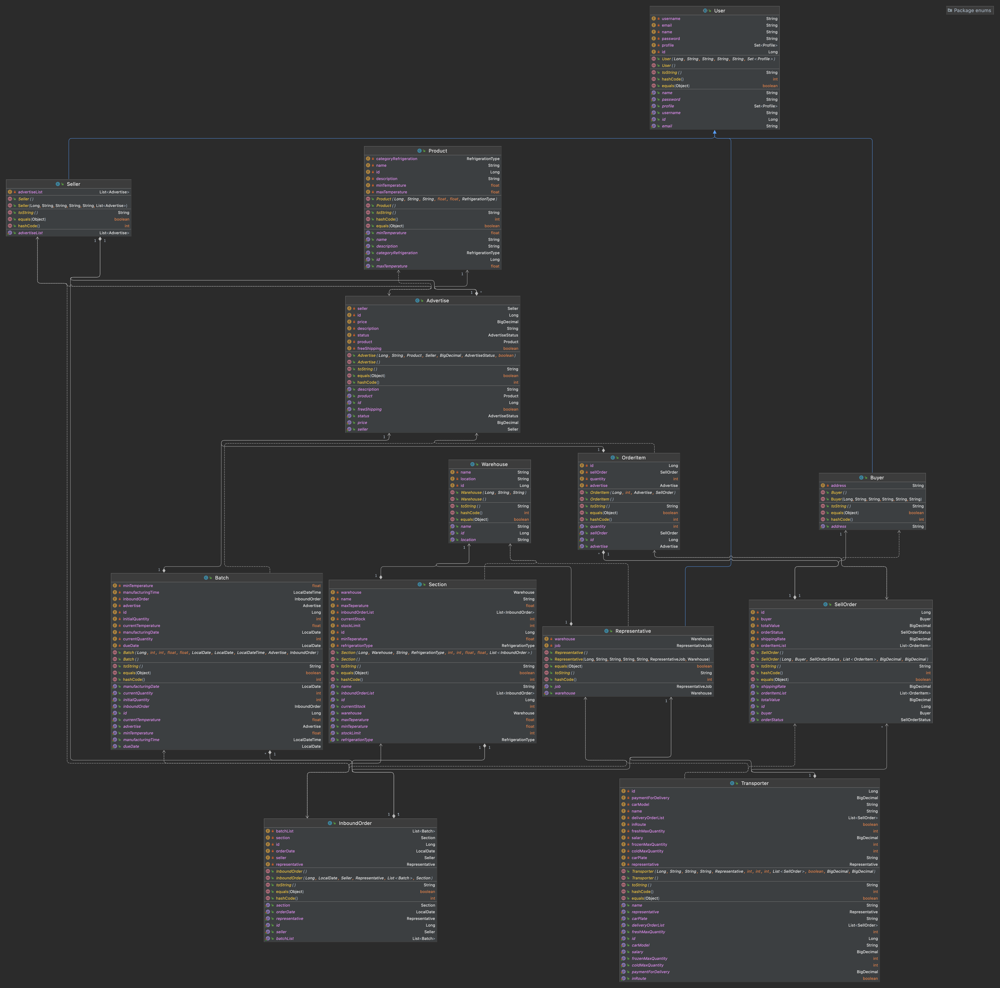

# Modelo UML

### Diagrama de Classes

Versão Final - Diagrama de Classes UML

Link para [Arquivo .UML](https://netto-meli.github.io/w4g9-projeto-final/guide/modelos/assets/entity.uml "Diagrama de Classes UML"), 
se desejar abrir num editor externo.

Link da imagem do [Diagrama de Classes UML](https://netto-meli.github.io/w4g9-projeto-final/guide/modelos/images/entity.png "Diagrama de Classes UML"),
abrir em outra janela para poder visualizar melhor

 

Versão inicial - Diagrama de Classes UML

