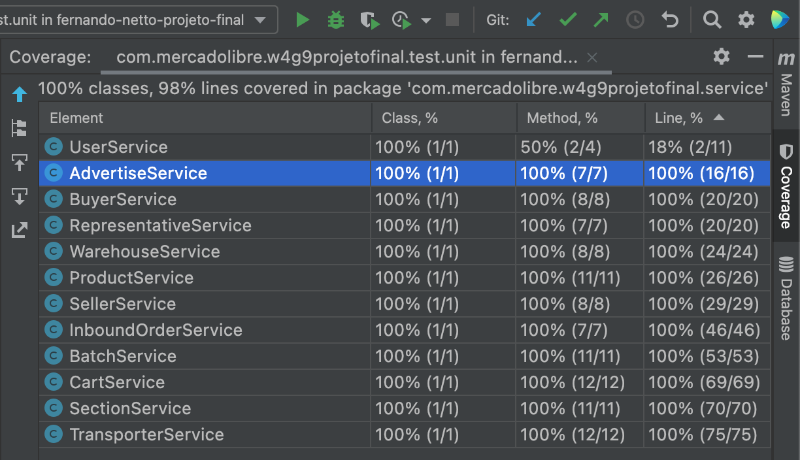

# Endpoints Referentes aos Requisitos
#### Admin ja cadastrado para acesso aos endpoints
login: **admin**<br>
senha: **123**
### Cobertura dos Testes Unitários
<details><summary>Test Coverage</summary><p>
Obs: UserService com baixa cobertura, pois ele cobre métodos de segurança que não foram Mockados.



</p></details>

### Requisitos
<details><summary>US - 1</summary><p>

| HTTP | LINK                                                     |
|------|----------------------------------------------------------|
| POST | http://localhost:8080/api/v1/fresh-products/inboundorder |
| PUT  | http://localhost:8080/api/v1/fresh-products/inboundorder |

```JSON
{
  "order_number": 1,
  "order_date": "2022-01-28",
  "section": {
    "section_code": "1",
    "warehouse_code": "1"
  },
  "batch_stock": [
    {
      "batch_number": 1,
      "advertise_id": 1,
      "current_temperature": 9.0,
      "minimum_temperature": 1.0,
      "initial_quantity": 2,
      "current_quantity": 2,
      "manufacturing_date": "2022-01-28",
      "manufacturing_time": "2022-01-28T08:28:56.775775",
      "due_date": "2022-01-28"
    }
  ]
}
```
</p></details>

<details><summary>US - 2</summary><p>

| HTTP | Modelo de URI                                                                                    |
|------|--------------------------------------------------------------------------------------------------|
| GET  | http://localhost:8080/api/v1/fresh-products/product                                              |
| GET  | http://localhost:8080/api/v1/fresh-products/product/listCategory/{{categoryProd}}                |
| POST | http://localhost:8080/api/v1/fresh-products/cart/addProduct/{{idBuyer}}?idAdvertise=&qtdProduct= |
| GET  | http://localhost:8080/api/v1/fresh-products/cart/{{idBuyer}}                                     |
| PUT  | http://localhost:8080/api/v1/fresh-products/cart/createSellOrder/{{idBuyer}}                     |


</p></details>

<details><summary>US - 3</summary><p>

| HTTP | LINK                                                                        |
|------|-----------------------------------------------------------------------------|
| GET  | http://localhost:8080/api/v1/fresh-products/product/listBatch/?id=          |
| GET  | http://localhost:8080/api/v1/fresh-products/product/listBatch/{{order}}?id= |

</p></details>

<details><summary>US - 4</summary><p>

| HTTP | LINK                                                                   |
|------|------------------------------------------------------------------------|
| GET  | http://localhost:8080/api/v1/fresh-products/warehouse/byProduct/{{id}} |

</p></details>

<details><summary>US - 5</summary><p>

| HTTP | LINK                                                                                                              |
|------|-------------------------------------------------------------------------------------------------------------------|
| GET  | http://localhost:8080/api/v1/fresh-products/due-date/bySection/{{numberOfDays}}?sectionId=                        |
| GET  | http://localhost:8080/api/v1/fresh-products/due-date/byRefrigeration/{{numberOfDays}}?refrigerationType=&orderBy= |

</p></details>


## Endpoints Dos Requisitos Individuais


<details><summary>US - 6 - Felipe</summary><p>

| HTTP   | LINK                                                       |
|--------|------------------------------------------------------------|
| GET    | http://localhost:8080/api/v1/fresh-products/section        |
| GET    | http://localhost:8080/api/v1/fresh-products/section/{{id}} |
| POST   | http://localhost:8080/api/v1/fresh-products/section        |
| DELETE | http://localhost:8080/api/v1/fresh-products/section/{{id}} |
| PUT    | http://localhost:8080/api/v1/fresh-products/section/{{id}} |

</p></details>

<details><summary>US - 6 - Fernando</summary><p>

| HTTP   | LINK                                                                               |
|--------|------------------------------------------------------------------------------------|
| POST   | http://localhost:8080/api/v1/fresh-products/delivery                               |
| PUT    | http://localhost:8080/api/v1/fresh-products/delivery/[idEntregador]                |
| DELETE | http://localhost:8080/api/v1/fresh-products/delivery/[idEntregador]                |
| GET    | http://localhost:8080/api/v1/fresh-products/delivery/[idEntregador]                |
| GET    | http://localhost:8080/api/v1/fresh-products/delivery/                              |
| GET    | http://localhost:8080/api/v1/fresh-products/delivery/byStatus/?isInRoute=[boolean] |
| POST   | http://localhost:8080/api/v1/fresh-products/delivery/delivery                      |
| PUT    | http://localhost:8080/api/v1/fresh-products/delivery/delivery/[idEntregador]       |

</p></details>

<details><summary>US - 6 - Leonardo</summary><p>

| HTTP   | LINK                                                     |
|--------|----------------------------------------------------------|
| GET    | http://localhost:8080/api/v1/fresh-products/buyer        |
| GET    | http://localhost:8080/api/v1/fresh-products/buyer/{{id}} |
| POST   | http://localhost:8080/api/v1/fresh-products/buyer        |
| DELETE | http://localhost:8080/api/v1/fresh-products/buyer/{{id}} |
| PUT    | http://localhost:8080/api/v1/fresh-products/buyer/{{id}} |

</p></details>

<details><summary>US - 6 - Marcos</summary><p>

| HTTP | LINK                                                                      |
|------|---------------------------------------------------------------------------|
| POST | http://localhost:8080/api/v1//api/v1/auth/forgot/?email=email@exemplo.com |

</p></details>

<details><summary>US - 6 - Rafael</summary><p>

| HTTP    | LINK                                                         |
|---------|--------------------------------------------------------------|
| GET     | http://localhost:8080/api/v1/fresh-products/warehouse        |
| GET     | http://localhost:8080/api/v1/fresh-products/warehouse/{{id}} |
| POST    | http://localhost:8080/api/v1/fresh-products/warehouse        |
| DELETE  | http://localhost:8080/api/v1/fresh-products/warehouse/{{id}} |
| PUT     | http://localhost:8080/api/v1/fresh-products/warehouse/{{id}} |

</p></details>